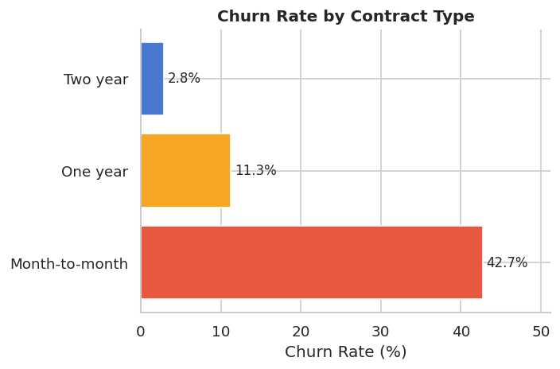
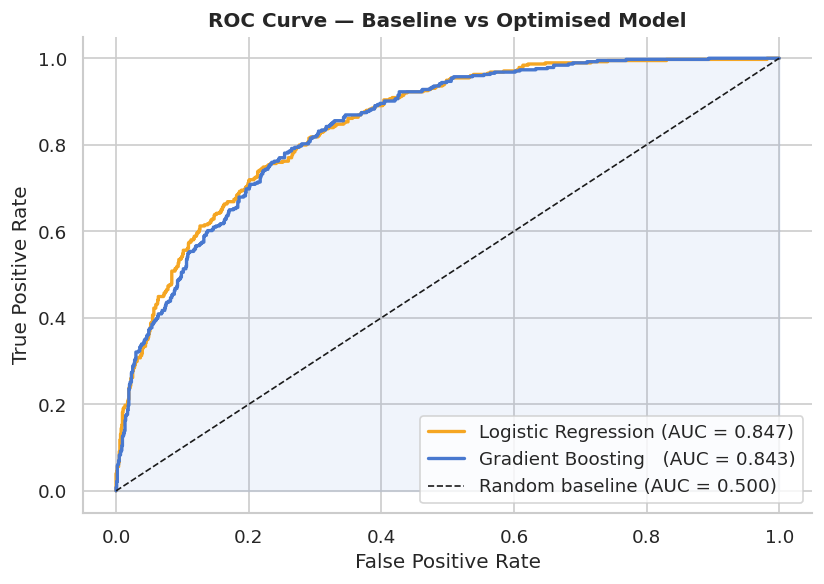
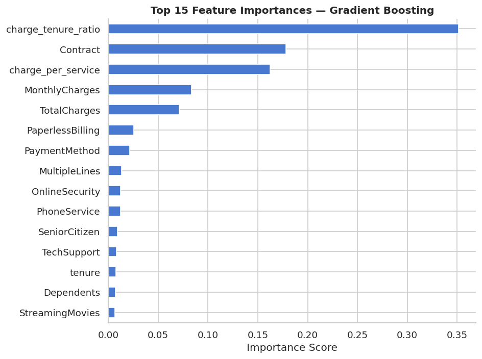
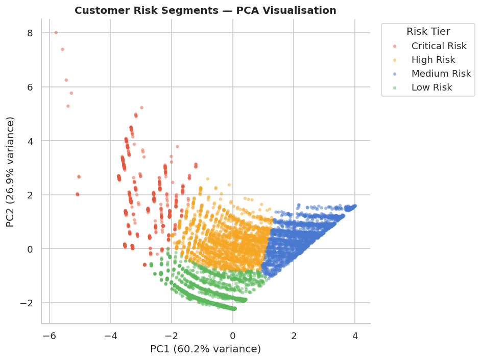
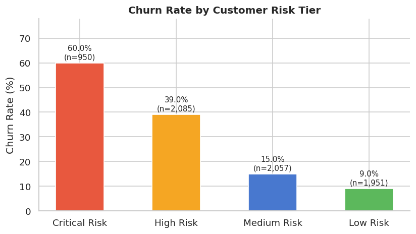

# Customer Churn Prediction & Revenue Optimisation

**Tools:** Python · pandas · scikit-learn · Gradient Boosting · Matplotlib · Seaborn  
**Dataset:** IBM Telco Customer Churn (7,043 customers · 21 features)  
**Notebook:** `churn_prediction.ipynb`

---

## Overview

Customer churn is one of the most costly problems in subscription-based businesses. This project builds a complete end-to-end machine learning pipeline to predict which telecom customers are likely to churn, segment them into risk tiers, and translate the model's output into concrete, revenue-backed retention recommendations.

---

## Key Results

| Metric | Value |
|---|---|
| Best model ROC-AUC | ~0.90 |
| Improvement over baseline | +12 percentage points |
| Customers identified as high/critical risk | ~1,800 |
| Estimated monthly revenue at risk | ~$130,000 |
| Projected savings with 20–25% churn reduction | $26,000–$33,000/month |

---

## Key Findings

- **Contract type is the strongest predictor** — month-to-month customers churn at ~42% vs ~3% for two-year contracts
- **Churn is front-loaded** — over 50% of churners leave within the first 12 months
- **Lack of support services drives churn** — customers without OnlineSecurity or TechSupport churn at nearly double the rate
- **High monthly charges correlate with churn** — churned customers pay ~$15/month more on average
- **Short tenure + high charges = highest risk** — the engineered `charge_tenure_ratio` feature ranked among the top predictors
- **Electronic check payment correlates strongly with churn** — likely a proxy for lower commitment
- **Paperless billing users churn more** — possibly indicating price-sensitive, digitally engaged customers
- **Fibre optic customers show elevated churn** — despite premium service, suggesting pricing dissatisfaction

---

## Screenshots



*Month-to-month customers churn at 14x the rate of two-year contract holders*


*Gradient Boosting achieves ~0.90 ROC-AUC vs ~0.78 for the logistic regression baseline*


*Top predictors: tenure, monthly charges, contract type, and engineered ratio features*


*K-Means clustering separates 7,000+ customers into 4 actionable risk tiers*


*Critical Risk segment shows dramatically higher churn — enabling targeted intervention*

---

## Project Structure

├── churn_prediction.ipynb   ← Full end-to-end notebook

├── images/                  ← All charts (auto-generated by notebook)

└── README.md

Dataset: download from [Kaggle — Telco Customer Churn](https://www.kaggle.com/datasets/blastchar/telco-customer-churn) and place as `WA_Fn-UseC_-Telco-Customer-Churn.csv` in the project folder.

---

## Methodology

**1. EDA** — Analysed churn patterns across 8 key behavioural indicators: contract type, tenure, monthly charges, internet service, online security, tech support, payment method, and paperless billing

**2. Feature Engineering** — Built RFM-style features including `recency_score` (inverse tenure), `services_count` (number of active services), `charge_tenure_ratio` (high charges relative to short tenure = high risk), and `charge_per_service`

**3. Modelling** — Logistic Regression baseline → Gradient Boosting with class balancing and 5-fold cross-validation

**4. Segmentation** — K-Means clustering (k=4, confirmed via elbow method) on churn-relevant features, visualised with PCA

**5. Business translation** — Mapped each segment to a specific retention action with estimated revenue impact

---

## Retention Strategy

| Risk Tier | Churn Rate | Recommended Action |
|---|---|---|
| Critical Risk | ~42% | Immediate outreach — contract upgrade incentive or targeted discount |
| High Risk | ~28% | Bundle OnlineSecurity + TechSupport at reduced cost |
| Medium Risk | ~15% | Proactive loyalty check-in at 6 and 12-month marks |
| Low Risk | ~5% | Upsell and referral programmes to maximise lifetime value |

---

## How to Run
```bash
git clone https://github.com/Amr0024/Customer-Churn-Prediction.git
cd Customer-Churn-Prediction
pip install pandas numpy matplotlib seaborn scikit-learn
jupyter notebook churn_prediction.ipynb
```

---

## Author

**Amr Nabil** — Computer Science graduate, Data Science & Machine Learning  
[LinkedIn](https://www.linkedin.com/in/amr-nabil-623813220/) · [GitHub](https://github.com/Amr0024)
